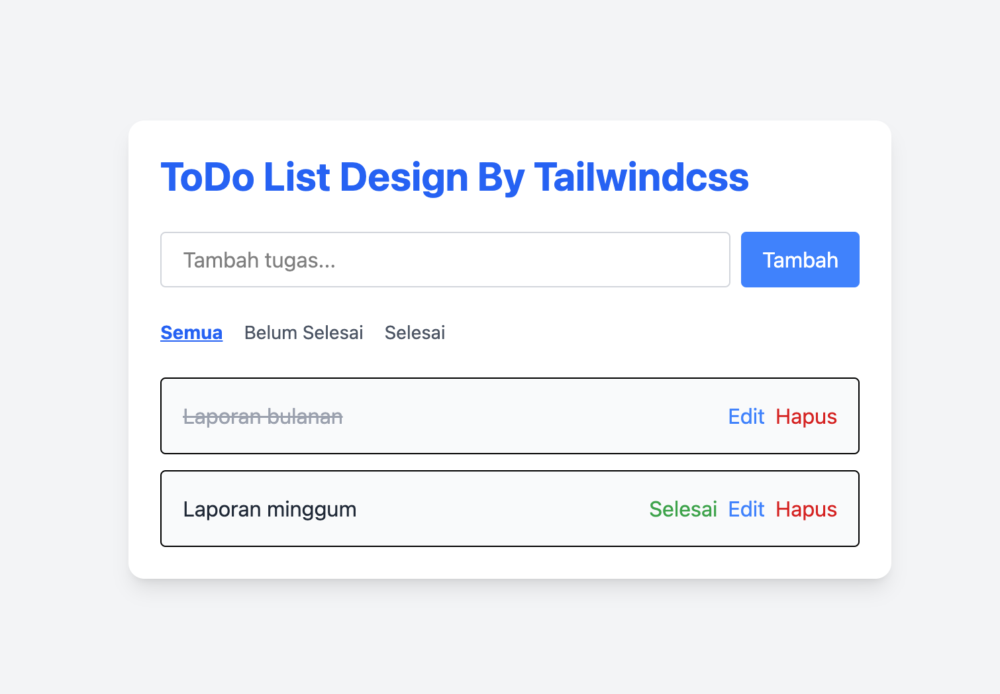

# 📝 Laravel ToDo List App

Aplikasi manajemen tugas sederhana berbasis Laravel.  
Dibuat sebagai bagian dari portofolio untuk menunjukkan kemampuan dalam membangun aplikasi CRUD dengan UI modern.

## 🚀 Fitur
- Tambah tugas
- Edit tugas
- Tandai tugas sebagai selesai
- Hapus tugas
- Filter tugas (Semua / Selesai / Belum Selesai)
- Tampilan responsive menggunakan TailwindCSS
- Build modern dengan Vite

## 🛠️ Teknologi yang Digunakan
- Laravel Framework 12.18.0
- PHP 8.2
- TailwindCSS 3
- Vite
- MySQL

## 📷 Screenshot

> Tampilan utama aplikasi:

## ⚙️ Cara Menjalankan di Lokal

1. Clone repository ini:
`bash
git clone https://github.com/afrizalcode/laravel-todolist.git
cd laravel-todolist

2. Install dependencies:
`bash
composer install
npm install

3. Salin file .env dan generate key:
cp .env.example .env
php artisan key:generate

4. Jalankan migrasi:
php artisan migrate

5. Jalankan development server:
npm run dev
php artisan serve

Aplikasi akan bisa diakses di http://127.0.0.1:8000

---

📄 Lisensi

Proyek ini dibuat untuk pembelajaran dan portofolio pribadi. Bebas digunakan kembali atau dimodifikasi.

---

✍️ Author

GitHub: @afrizalcode

Nama: Afrizal Marzuki